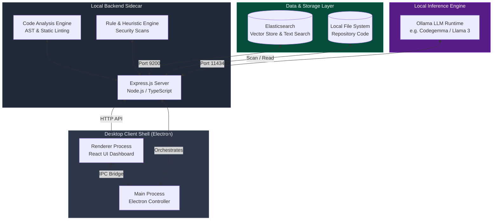
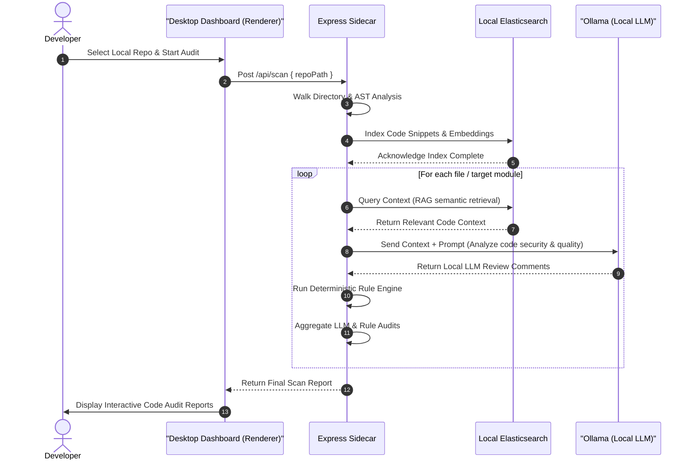

# Compact: Local-First, Privacy-Preserving AI Code Review Ecosystem

**Compact** is a secure, local-first AI-powered code review and security analysis platform designed to audit codebases for security vulnerabilities, code quality issues, performance bottlenecks, and style violations. Unlike traditional cloud-based code review services, **Compact** runs entirely on your local machine, ensuring complete source code privacy and eliminating dependencies on external APIs.

---

## Key Features

*   **Absolute Source Code Privacy**: Code analysis, vector embedding, and LLM inference run entirely locally (using Ollama and Elasticsearch). No code leaves your system.
*   **Repository-Aware Intelligence**: Uses Retrieval-Augmented Generation (RAG) and repository indexing to analyze code with full context of project structure, files, and dependencies.
*   **Hybrid Analysis**: Combines local LLM reasoning with a deterministic Rule/Heuristic Engine to check for code smells, OWASP Top 10 vulnerabilities, and syntax patterns.
*   **Interactive Dashboard**: A modern web/desktop dashboard to view code reviews, inspect issues, and track historical technical debt.
*   **Multi-Format Export**: Export detailed audit reviews to PDF, JSON, and Markdown formats.

---

## System Architecture & Design

Compact is designed as a local-first desktop application. It utilizes a hybrid architecture combining a desktop shell with a backend sidecar service to coordinate heavy computation tasks (AST parsing, Elasticsearch indexing, and LLM inference) without compromising performance or privacy.

### 1. Hybrid Desktop Architecture
The desktop application is built on top of **Electron**, separating UI rendering from system-level file-system and daemon management.



### 2. Detailed Component Design

*   **Presentation Layer (Renderer Process)**: A modern desktop dashboard interface built with React and Tailwind CSS. It manages scan states, highlights code issues, renders side-by-side diff comparisons, and presents technical debt metrics.
*   **Orchestration & Application Layer (Express.js Sidecar)**: Spawns as a background Node.js service. It coordinates AST parsers, triggers the rules engine, handles semantic chunking, embeds source fragments, and makes local HTTP requests to Ollama and Elasticsearch.
*   **Vector Database & Context Retrieval (Elasticsearch)**: Configured as a local vector search engine. It stores code snippet chunks, generates vector embeddings, and performs similarity searches. When reviewing a file, it retrieves syntactically and semantically related code from other parts of the repository (RAG).
*   **Deterministic Rule/Heuristic Engine**: Prior to LLM analysis, this engine performs AST parsing to detect code smells, styling violations, and security hotspots (like hardcoded keys or insecure API usage) instantly.
*   **Local LLM Inference Engine (Ollama)**: Houses the local LLM. It receives the prompt containing the target code + RAG-retrieved relevant context, performing local inference to yield deep, context-aware suggestions.

### 3. Execution Data Flow (Sequence Diagram)

The following sequence details how the application indexes, retrieves, reviews, and aggregates code analysis reports offline:



---

## Technology Stack

| Architecture Layer | Component / Technology | Purpose |
| :--- | :--- | :--- |
| **Desktop Shell** | Electron (with TypeScript) | Renders the cross-platform application UI and manages background daemons. |
| **User Interface** | React, CSS (Tailwind CSS), Lucide Icons | Responsive, modern dashboard displaying code audits and technical debt metrics. |
| **Service Orchestrator** | Node.js, Express.js, TypeScript | Backend service managing code analysis pipelines and REST API routes. |
| **Semantic Search & RAG**| Elasticsearch | Local search engine indexing repositories and retrieving relevant context via vector search. |
| **Local LLM Engine** | Ollama | Runs local model inference (e.g., CodeGemma, DeepSeek-Coder, Llama 3). |
| **Static Code Parsing** | AST (Babel / ESLint Parser) | Generates Abstract Syntax Trees for structured code and dependency mapping. |
| **Static Security Scan** | Rule & Heuristic Engine | Runs offline security scans (e.g., pattern matching, vulnerability signatures). |

---

## System Requirements

### Hardware Requirements
*   **Processor**: Intel Core i5 / AMD Ryzen 5 or higher
*   **Memory**: Minimum 16 GB RAM (**32 GB recommended** for smoother Elasticsearch + LLM execution)
*   **Storage**: SSD storage with sufficient free space for repository indexing and LLM weights
*   **GPU**: NVIDIA GPU (optional, but highly recommended for fast local inference)

### Software Requirements
*   **Operating System**: Windows 10/11 or Linux
*   **Dependencies**:
    *   [Ollama](https://ollama.com/) (Local LLM Runtime)
    *   [Elasticsearch](https://www.elastic.co/elasticsearch/) (For indexing and semantic search)
    *   [Node.js](https://nodejs.org/) (LTS version)
    *   TypeScript & Git

---

## Comparison with Existing Work

| Tool | Methodology | Key Limitation | How Compact Solves It |
| :--- | :--- | :--- | :--- |
| **CodeRabbit** | Automated cloud-based AI code reviews. | Cloud dependency; code privacy issues. | **100% Local-First** execution. |
| **SWE-agent** | LLM-based autonomous agent for engineering tasks. | Generalist agent, not optimized for reviews. | Focuses specifically on **code quality & security audits**. |
| **SonarQube / CodeQL**| Rule-based static code analysis. | Lacks semantic reasoning and context awareness. | Integrates **LLMs with RAG** for deep contextual reviews. |

---

## Quick Start & Setup

### 1. Prerequisites Setup
Make sure you have Elasticsearch and Ollama installed and running.

*   **Ollama**: Start the Ollama server and pull a code-focused model (e.g., `codegemma` or `llama3`):
    ```bash
    ollama pull codegemma
    ```
*   **Elasticsearch**: Ensure your Elasticsearch instance is active on `http://localhost:9200`.

### 2. Installation
Clone the repository and install dependencies:
```bash
# Clone the repository (if not already cloned)
git clone <repository-url>
cd Compact-Desktop-Application-version

# Install backend dependencies
npm install
```

### 3. Running the Server
Run the development environment:
```bash
npm run dev
```

---

## Project Team

*   **Vaishnavi Nikam**
*   **Sneha More**
*   **Lokesh Khairnar**
*   **Kanhaiya Bagul**
